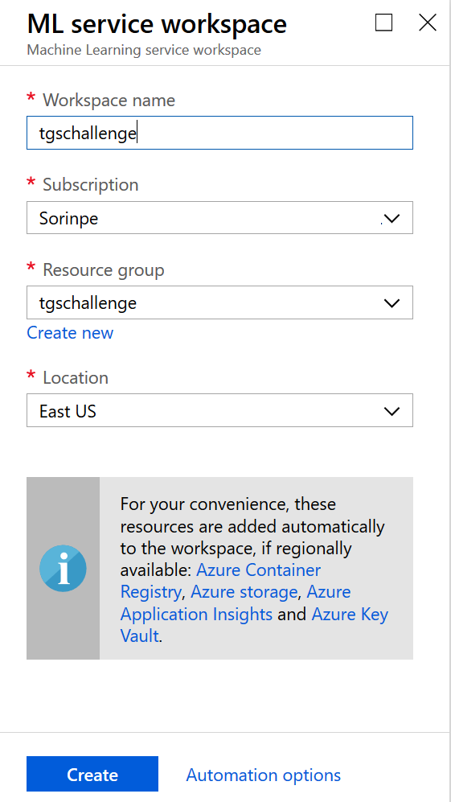
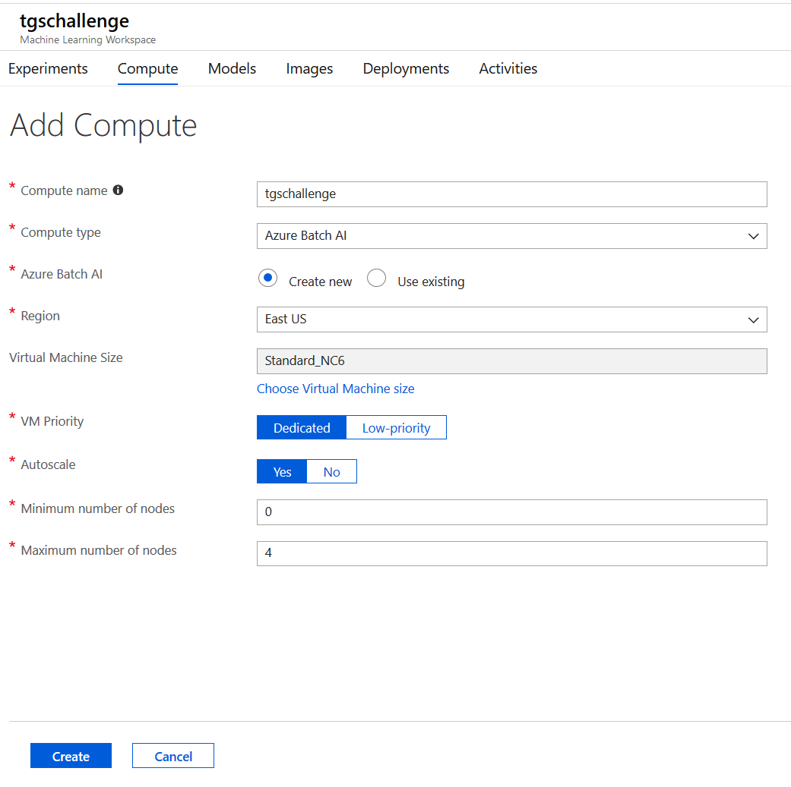
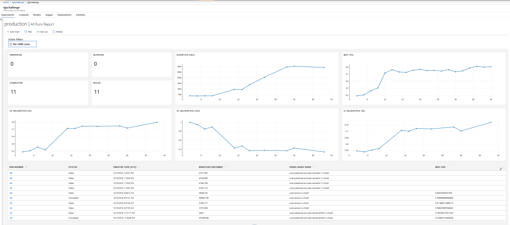
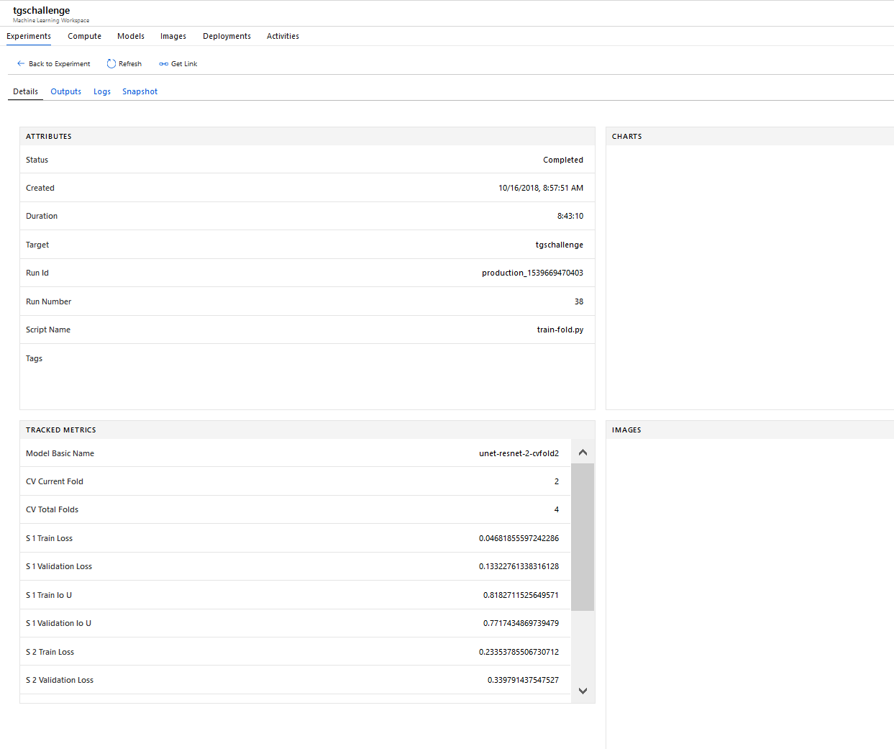
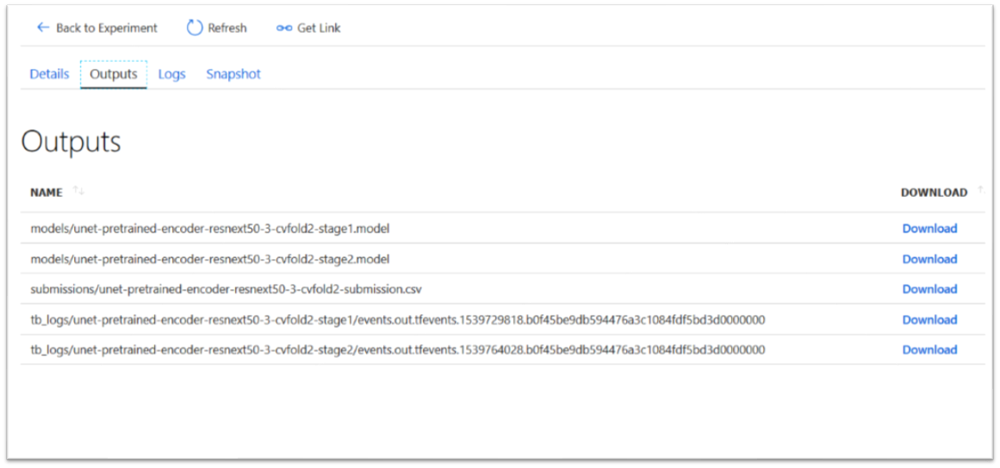
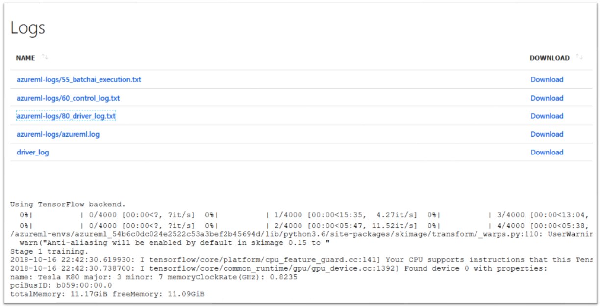

# TGS Salt Identification Challenge

This is a solution to the [TGS Salt Identification Challenge](https://www.kaggle.com/c/tgs-salt-identification-challenge) competition which ran on Kaggle in 2018.

## The problem: Segment salt deposits beneath the Earth's surface

Several areas of Earth with large accumulations of oil and gas also have huge deposits of salt below the surface.

But unfortunately, knowing where large salt deposits are precisely is very difficult. Professional seismic imaging still requires expert human interpretation of salt bodies. This leads to very subjective, highly variable renderings. More alarmingly, it leads to potentially dangerous situations for oil and gas company drillers.

To create the most accurate seismic images and 3D renderings, TGS (the world’s leading geoscience data company) is hoping Kaggle’s machine learning community will be able to build an algorithm that automatically and accurately identifies if a subsurface target is salt or not.

## How to use this solution

This solution trains various image segmentation models on the training data provided by TGS as part of the competition. Then, it uses the trained models to predict segmentation masks for the 18,000 test images also provided by TGS, and generate the CSV submission files for the competition. 

## Prerequisites

1. A machine with a fast GPU card and at least 16 GB of RAM (32 GB recommended). Alternatively you can use the cloud - for example spin up a [Microsoft Azure N-Series VM](https://azure.microsoft.com/en-us/pricing/details/virtual-machines/series/). 

    > NOTE: [Click here](https://azure.microsoft.com/en-us/free/) to get a free Azure trial. A valid credit card is required, but you will not be charged.

2. The [Anaconda](https://www.anaconda.com/) distribution with Python 3.6 or later. If you want to use a pre-configured machine in Azure, you can opt for the [Data Science Virtual Machine](https://azuremarketplace.microsoft.com/en-us/marketplace/apps/microsoft-ads.linux-data-science-vm-ubuntu).

3. The [Git](https://git-scm.com/) client.

4. (Optional) A code editor - you can have your pick between Visual Studio Code, PyCharm, Spyder or others.

5. (Optional) A free [Kaggle](https://www.kaggle.com/) account - required only if you want to score your models on Kaggle's test data.

6. (Optional) An [Azure Machine Learning](https://azure.microsoft.com/en-us/services/machine-learning-service/) workspace - required only if you want to scale out to multiple machines, so you can train multiple models in parallel, or train on many data folds, etc. with the least amount of server management required.

## Setup

1. Download and install [Anaconda](https://www.anaconda.com/).

2. [Open an Anaconda prompt](https://conda.io/docs/user-guide/getting-started.html).

3. [Create a new conda environment](https://conda.io/docs/user-guide/getting-started.html#managing-environments):

    `conda create --name tgschallenge python=3.6`

4. Activate the new environment:

    - on Windows, run `activate tgschallenge`
    - on Linux or MacOS, run `source activate tgschallenge`

5. Navigate to a folder where you want to host the solution code.

6. Clone this repository in that folder:

    `git clone https://github.com/neaorin/kaggle-tgs-challenge`

7. Create a folder to store the train and test data:

    `mkdir data`

8. Download the [train and test image data](https://www.kaggle.com/c/tgs-salt-identification-challenge/data) from Kaggle. You can use the **Download** link on that page, or the Kaggle API as described in the same page.

    You will need to unpack the data inside your locally-created `data` folder. You should end up with the following folder structure:

    ```sh
    kaggle-tgs-salt
    └--- data
        └--- test
            └--- images
                └--- (*).png (18,000 files)
        └--- train
            └--- images
                └--- (*).png (4,000 files)
            └--- masks
                └--- (*).png (4,000 files)
        depths.csv
        sample_submission.csv
        train.csv
    ```

9. Navigate to the `code` folder:

    `cd code`

10. Install the Python prerequisites:

    `pip install -r requirements.txt`


## Train a model locally

In order to train a model, you will use the [`train_fold.py`](code/train_fold.py) script. The script takes the following parameters as input:

* `--config-file` - JSON file containing run configuration. There are example files inside the `code/train-config` folder for various neural network architectures which could be used for this problem. 

* `--cv-currentfold` - The number of the specific cross-validation fold to use in this training run. This controls the specific training / validation split of data. As an example, for a 4-fold [cross-validation](https://en.wikipedia.org/wiki/Cross-validation_(statistics)) strategy, you would want to train four separate models - that is, run the `train-fold.py` script four times, using `0`, `1`, `2`, and `3` for the `--cv-currentfold` parameter, and then average the predictions. If you don't want to do cross-validation, and go with a single test/validation split, you can omit this parameter. In the latter case, your model might not generalize as well.

* `--data-folder` - Folder containing the input data (default is the `data` folder)

* `--outputs-folder` - Folder where outputs should be saved (default is the `outputs` folder which will be created automatically if it doesn't exist)

### Example

To train a relatively simple [U-Net](https://arxiv.org/abs/1505.04597) with [ResNet](https://arxiv.org/abs/1512.03385) blocks, you can issue the following command from the `code` folder:

`python train_fold.py --config-file train-config/unet-resnet.json`

Be prepared to wait until the training run is complete. Depending on the number of training epochs (you can configure them in the `unet-resnet.json` file), it may take multiple hours to finish training.

## Examining the results

Once the training run is complete, you will find the results in the `outputs` folder:

- `figures` - charts for the various training run metrics.

- `models` - the trained models. There may be multiple stages employed during training, therefore each run might produce multiple models.

- `submissions` - CSV files which contain predictions for all the 18,000 test images, and can be [submitted to Kaggle](https://www.kaggle.com/c/tgs-salt-identification-challenge/submit) to check the performance on the test data

- `tb_logs` - [TensorBoard](https://www.tensorflow.org/guide/summaries_and_tensorboard) log data.

## Scale out training with Azure Machine Learning

You can use [Azure Machine Learning](https://azure.microsoft.com/en-us/services/machine-learning-service/) to train multiple models in parallel, or train the same model on multiple data folds (cross-validation) without the headaches involved in managing multiple Virtual Machines, and the associated cost-control implications.

Azure Machine Learning allows you to [define compute resources](https://docs.microsoft.com/en-us/azure/machine-learning/service/concept-azure-machine-learning-architecture#compute-target) for training models. You have a choice of multiple types of resources, from single VMs to [Batch AI Clusters](https://azure.microsoft.com/en-us/services/batch-ai/) which can scale automatically up and down to meet the demand for capacity.

Azure Machine Learning allows you to [submit training jobs](https://docs.microsoft.com/en-us/azure/machine-learning/service/how-to-set-up-training-targets#submit-training-run) to your compute resources via Python, and track those runs and their metrics [in the Azure portal](https://docs.microsoft.com/en-us/azure/machine-learning/service/how-to-track-experiments#view-the-experiment-in-the-azure-portal) or [with code](https://docs.microsoft.com/en-us/azure/machine-learning/service/how-to-track-experiments#view-run-details).

Azure Machine Learning also allows you to [deploy your trained models](https://docs.microsoft.com/en-us/azure/machine-learning/service/how-to-deploy-and-where) as Docker containers to individual servers or Kubernetes clusters, in order to be consumed by external applications - although this feature is not used here.

### Set up Azure Machine Learning

1. [Create an Azure ML Workspace](https://docs.microsoft.com/en-us/azure/machine-learning/service/how-to-manage-workspace). You could name it `tgschallenge`.

    

2. [Configure your local evironment](https://docs.microsoft.com/en-us/azure/machine-learning/service/how-to-configure-environment#create-a-workspace-configuration-file) to use the workspace. You need to create or update the `aml_config/config.json` file with the correct workspace identification data:

    ```json
    {
        "subscription_id": "(GUID)",
        "resource_group": "(resource group name)",
        "workspace_name": "(workspace name)"
    }
    ```

    Test that your setup is correct by using the following code:

    `python aml_config/test.py`

3. Upload the training data to the workspace - this may take a while depending on your upload bandwidth:

    `python aml_config/upload-data.py`

4. Create a Batch AI Cluster with auto-scale and four maximum nodes with GPUs (**N-Series VMs**).

    `python aml_config/create-cluster.py`

    Alternatively, from the workspace main page in the Azure Portal, you can use the web wizard to create the cluster - below is an example. Make sure you name the cluster **tgschallenge**.

    


### Start a 4-fold cross-validation run on Azure Machine Learning

You can now train four models in parallel, on four separate train/validation folds on the data:

`python azureml-submit-run.py --config-file train-config\unet-resnet.json --entry-script train-fold.py --experiment-name production`

The `azureml-submit-run.py` script will submit four separate `train-fold.py` runs to the Azure Machine Learning workspace, which will execute in parallel - provided you have created a Batch AI Cluster with four maximum nodes. Once the jobs are finished, Batch AI will automatically scale down the cluster to zero nodes, which means you won't be charged anything while the cluster is idle.

### Monitor your runs

You can monitor your Azure ML runs in the Azure Portal. You can track job status, job metrics, create additional charts, view log files and download outputs.







